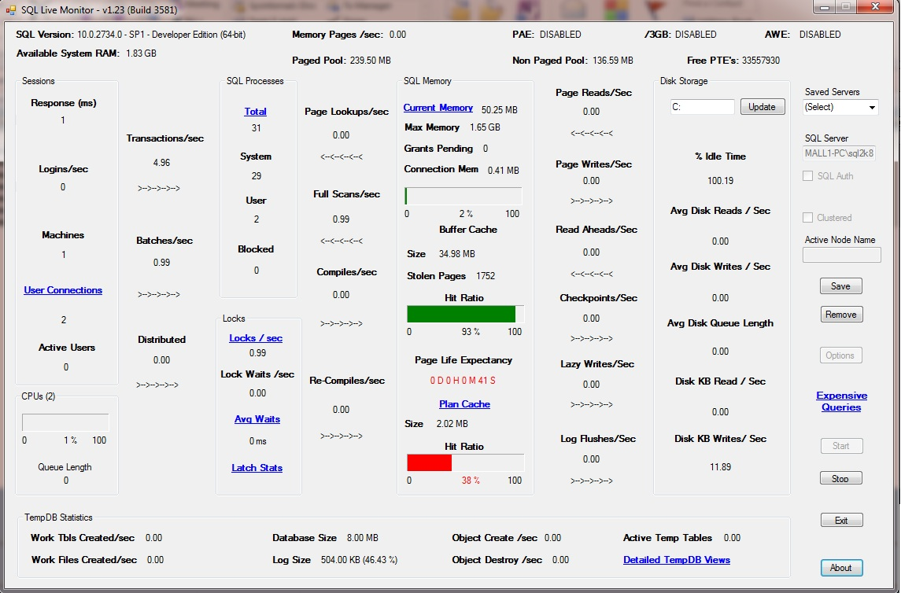

5# SQL Live Monitor

# Description

a .NET application that provides realtime performance data on the target SQL Server instance.

No installation required, data displayed in realtime, and can also be logged to CSV for offline analysis. Will also capture SQL data for processing uing PAL.

# Features

This tool is designed to provide realtime performance data on SQL Server, as well as data capture for offline analysis. The tools features are:
* Realtime SQL and System performance data 
* Colour coded alerts 
* Capture data logging to CSV - sample interval configurable 
* PAL Perfmon counter logged to .blg or .csv for offline analysis * * using PAL - sample interval configurable 
* Detailed view of certain SQL Areas via DMVs 
* List Top 20 Queries by CPU, IO and Execution Count 
* View SQL Waits by category 
* View SQL Scheduler and CPU worker threads 
* Monitor Kernel Pools and System PTE's 
* Supports SQL 2000 through to 2016 
* Captures data from local and remote servers 
* Captures data from default and named instances (stand alone & clustered) 
* Supports both SQL and Windows Authetication 
* Supports x86 and x64 
* No installation required 
* Application small in size with minimal overhead when running 
* Run multiple instances on same PC 

# Download

This version 1.34 is build for .net 4.5.2 [SQL Live Monitor](app/SQLMonitor.zip)
